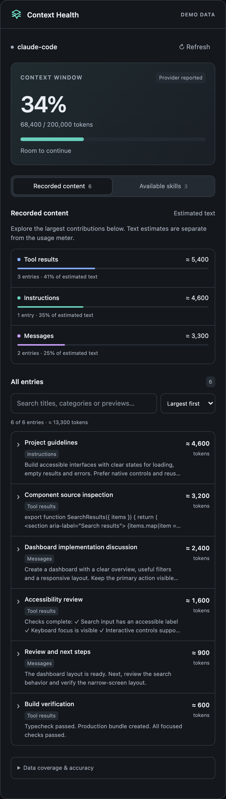
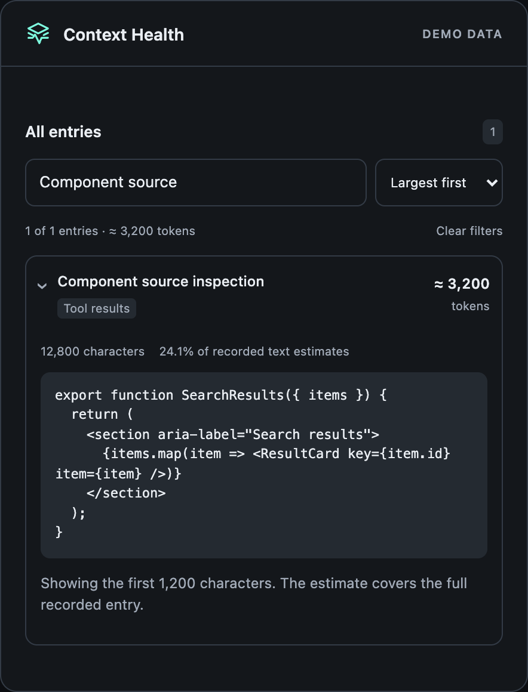
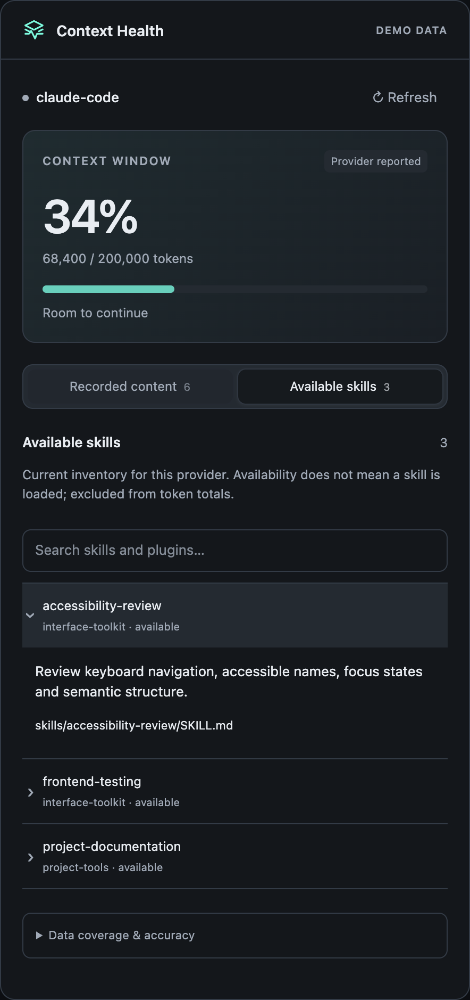
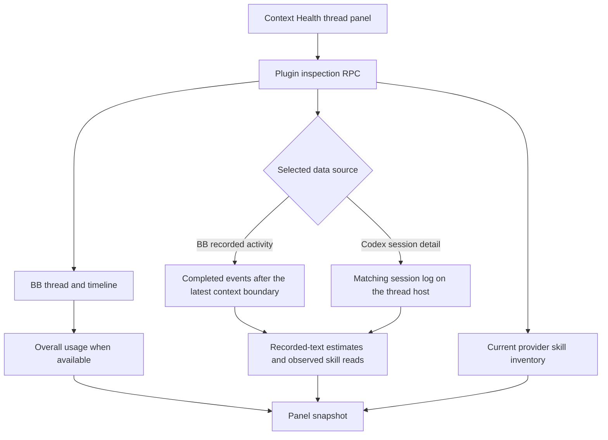

<div align="center">


# Context Health

### Find what is taking up your thread's context.

Explore recorded messages, tool output and skills in a BB thread panel.<br>
Find large contributions, inspect previews and understand the coverage.


[Features](#features) · [Install](#install) · [How it works](#how-it-works) · [Privacy](#privacy) · [Settings](#settings) · [Development](#development)

<br>



</div>

<br>

> [!NOTE]
> The screenshots show the BB panel populated with fictional demo data.

## The problem

Your thread fills up as you work. A usage total tells you how much space is used,
but it does not explain which recorded messages, tool results or instructions are large.

Context Health puts those contributions beside your conversation. You can explore
the recorded text and distinguish observed skill reads from the available inventory.

| At a glance | You get |
| --- | --- |
| Overall usage | BB's provider-reported or estimated usage, when available |
| Large contributions | Category bars and entries sorted by estimated text size |
| Skill evidence | Separate views for observed reads and available skills |
| Coverage | Notices explaining context boundaries and inspection limits |

## Features

<table>
<tr>
<td width="50%" valign="top">

### 📊 Context usage

See used tokens and context-window capacity when BB exposes them. The meter
preserves the provider-reported or estimated classification.

</td>
<td width="50%" valign="top">

### 🧩 Category breakdown

Compare recorded-text estimates with coloured bars. Select a category to focus
the entry browser.

</td>
</tr>
<tr>
<td valign="top">

### 🔎 Searchable entries

Search titles, categories and previews. Sort by size or name, expand an entry,
and show more results as you browse.

</td>
<td valign="top">

### 📖 Observed skill reads

Inspect skill contents found in recorded tool results. Read evidence does not
guarantee the skill remains in context after compaction.

</td>
</tr>
<tr>
<td valign="top">

### 🗂️ Available skills

Browse the current provider's inventory, descriptions and plugin ownership.
Inventory entries are excluded from recorded-text totals.

</td>
<td valign="top">

### 🛠️ Codex session detail

Optionally read the matching session log on the thread host for additional
instructions, skill catalogue entries and dynamic tool definitions.

</td>
</tr>
</table>

<div align="center">
<table>
<tr>
<td align="center" valign="top"><br><sub><b>Entry drill-down</b></sub></td>
<td align="center" valign="top"><br><sub><b>Available skills</b></sub></td>
</tr>
</table>
</div>

## Install

```sh
bb plugin install git:https://github.com/MacHatter1/bb-context-health --yes
```

Open a thread's right panel, then choose **New tab → Context Health**.

<details>
<summary><b>Install from a local clone</b></summary>

```sh
git clone https://github.com/MacHatter1/bb-context-health
cd bb-context-health
npm ci --include=dev
bb plugin build
bb plugin install "path:$PWD" --yes
```

</details>

**Requirements**

- BB **0.42+**, with a compatible Plugin SDK runtime **0.4.48+**.
- Node.js and npm for source development. Tests use Node's `--experimental-strip-types`.
- Access to the matching session log on the thread host for optional Codex detail.

## Where to find it

| Where | What |
| --- | --- |
| **Thread right panel → New tab → Context Health** | Inspect usage, recorded content, loaded skills and available skills |
| **Data source** on Codex threads | Switch between BB recorded activity and Codex session detail |
| **Settings → Installed plugins → Context Health** | Override the Codex home directory on the thread host |

Select a category or search to filter entries. Expand an entry for its preview.
Open **Data coverage & accuracy** to see notices for the current snapshot.

## How it works



- **Two kinds of numbers.** The meter comes from BB. Entry sizes estimate
  recorded text at four Unicode characters per token, rounded up per entry.
  Category percentages describe that recorded text, not the model's capacity.
- **Context boundaries.** The shared view excludes activity before the latest
  context clear or compaction. Codex detail uses recorded replacement history
  or a summary after compaction.
- **Read evidence.** Loaded skills requires a recorded call referencing exactly
  one `SKILL.md` path and a result with skill name and description frontmatter.
  Its estimate is already counted under tool results.
- **Current inventory.** Available skills is filtered for the thread's provider.
  Availability does not prove that a skill was loaded.
- **Automatic refresh.** The panel refreshes every 30 seconds while visible,
  and when it becomes visible again. You can also refresh manually.

<details>
<summary><b>Provider support, estimates and inspection limits</b></summary>

The shared view uses BB's normalised events across Codex, Claude Code, Pi and ACP
providers. Detail depends on the text each provider exposes.

| Capability | Codex | Claude Code, Pi and ACP providers |
| --- | --- | --- |
| Recorded activity | Supported normalised items | Supported normalised items |
| Overall usage | When exposed by BB | When exposed by BB |
| Observed skill reads | Tool results and optional session logs | Tool results with qualifying evidence |
| Available skill inventory | Filtered for the provider | Filtered for the provider |
| Local session-log inspection | Optional | Not implemented |

Missing usage is displayed as **Unavailable**. Category totals do not add up to
the meter: hidden prompts, attachment contents, encrypted reasoning and
provider-side truncation are not fully measurable.

The shared view counts completed top-level items and accepted user text.
Recorded activity can include messages, commands, tool calls and results, web
activity, visible reasoning, plans and diffs. Codex detail also exposes recorded
instructions and tool definitions when present in the log.

| Inspection limit | Maximum |
| --- | --- |
| Shared activity | Latest 1,000 relevant events, in pages of 100 |
| Breakdown entries | 1,500 |
| Preview length | 1,200 JavaScript string code units per entry |
| Available skills | 1,500 |
| Codex log size | 64 MiB |
| Codex session discovery | 5,000 directories |

Older entries and skill-read evidence may be omitted. An empty Loaded skills
view means no qualifying evidence was found in the inspection window;
compaction, missing history and unrecognised read formats can affect detection.
Catalogue mentions and ambiguous multi-file references do not qualify.

Codex detail reads a stable byte snapshot of the session log. Incomplete or
malformed records are skipped and reported in coverage notices.

</details>

<details>
<summary><b>Troubleshooting</b></summary>

| Issue | What to check |
| --- | --- |
| Usage is unavailable | Refresh after a model response; the provider may not expose usage |
| Loaded skills is empty | Check for qualifying read evidence; on Codex, try session detail |
| Category totals differ from usage | The estimates and usage meter cover different data |
| Codex detail is unavailable | Check the environment host, session logs and Codex home setting |
| Older entries are missing | Check coverage notices for context boundaries and inspection limits |
| Refresh fails | Resolve the reported issue and refresh; the panel keeps the last successful snapshot when available |

</details>

## Privacy

- **Read-only inspection.** The plugin reads BB records and opens matching
  session files for reading. It does not modify those files.
- **No external analysis service.** Results return to the BB panel through
  plugin RPC. Context is not sent to a separate external service or stored in
  a plugin database.
- **No added agent context.** The plugin registers no agent tools, instructions,
  CLI commands or bundled skills.
- **Review before sharing.** Real entry previews and skill paths can contain
  private project information.

## Settings

`bb plugin config context-health`, or **Settings → Installed plugins → Context Health**.

<details>
<summary><b>All settings</b></summary>

| Setting | Default | Effect |
| --- | --- | --- |
| `codexHome` — Codex home on the thread host | Empty string | Optional absolute home-directory path, up to 4,096 characters, used only for Codex session detail |

When blank, the plugin uses `CODEX_HOME` on the thread host, or `~/.codex` when
unset. It searches the `sessions` directory inside that home for the matching
rollout log. Shared recorded activity does not require provider logs.

</details>

<details>
<summary><b>Turning it off</b></summary>

```sh
bb plugin disable context-health
bb plugin enable context-health
```

Use `bb plugin remove context-health` to uninstall it.

</details>

## Development

```sh
npm ci --include=dev
npm test
npm run typecheck
bb plugin build
bb plugin install "path:$PWD" --yes
bb plugin dev
```

`npm run check` remains available as the original typecheck command.
`bb plugin dev` watches source changes, rebuilds and reloads the installed
plugin. Use `bb plugin build` followed by `bb plugin reload context-health`
to rebuild and reload once.

```text
src/server.ts       Settings, RPC, usage and inventory orchestration
src/app.tsx         Thread panel UI
src/app.css         Panel styling
src/shared.ts       Provider-independent event inspection
src/analyze.ts      Codex log analysis and skill-read evidence
src/host.ts         Read-only session-file access
src/contract.ts     Validated RPC schemas
tests/              Node tests and panel interaction tests
assets/             Plugin icon, README logo and demo screenshots
CHANGELOG.md        Release history
```

**Tests** cover event deduplication, context boundaries, skill-read evidence,
JSON-safe RPC results, bounded pagination and log inspection, and panel
filtering, sorting and paging with the SDK test harness and JSDOM.

The development SDK uses `^0.4.48`, allowing updates within the 0.4 series;
`package-lock.json` records the version used for reproducible installs. The
runtime compatibility floor remains `>=0.4.48`. React is provided by BB at
runtime; Zod validates RPC data and YAML parses skill frontmatter. Keep
generated `dist/` bundles,
local `output/` previews and workspace state out of Git.

[PLUGIN_OVERVIEW.md](PLUGIN_OVERVIEW.md) is the store listing. Keep its claims
in step with this README and `bb.description` in `package.json`.

## Licence

[MIT](LICENSE)
